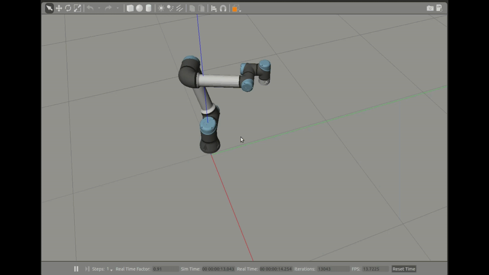
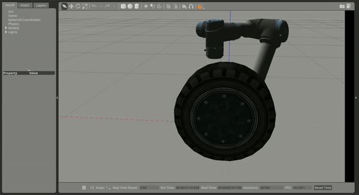

# Robotic_Arm_Algorithms

  It contains the common algorithms in robotic arm, and will be recording the development as soon as I have completed the any one algorithm. The chosen robot is **universal robot** which is the most popular collaborate robot in the world.

## Algorithm List

  **Notice**: In this repository, I have used ur5e robot and its `urdf` file need to be changed in different situation, like need or not a force/torque sensor in the end effector. Please check the `urdf` file seriously and run the algorithm, Thanks.

### 1. Admittance

  In compliant control, admittance control and impedance control are the most common control algorithms and equivalent each other. For running this algorithms, there are only two commands:

  First of all, running a gazebo environment and upload a universal robot. I usually chose a **ur5e**.

```bash
$ roslaunch ur_e_gazebo ur5e.launch controller:= cartesian_velocity_controller_sim
```

  Then, running the admittance control algorithm and you can observe the performance of it.

```bash
$ roslaunch Admittance Admittance_test.lanch
```

  In this lanch file, it contains a node to publish a wrench signal to imitate an external force caused by operator. If you want to run it without publish node and to publish by yourself other package, you can run the following command. And the performance is shown in following gif file.

```bash
$ roslaunch Admittance Admittance.launch
```

### 2. Hybrid Position Force Control

  In industrial polishing, coating painting, and so forth, the robotic arm needs to be controlled to move along the surface with pressure. The constant pressure provides a vertical force along the surface and won't be changed during moving. Because of it, the end effector and contact surface exist friction which causes the polishing and painting.

  In this control algorithms, I have used a car wheel to imitate a curve surface that needs to be processed. This control algorithm contains position servo and forces closed-loop control as its name.

  First of all, running the gazebo environment which contains a universal robot and a car wheel beside it.

```bash
$ roslaunch ur_e_gazebo ur5e.launch controller:=cartesian_velocity_controller_sim environment:=polish
```

  Then, running the hybrid position force control

```bash
$ roslaunch hybrid_position_force_control hybrid_position_force_control.launch
```

  And then it needs to use the topic publish command in the terminal. It is recommended to move to $[0.1,0.4,0.45]$ which along the **x** Axis at first, and then move to $[0.1,0.4,0.3]$ in **z** Axis. This makes the end contact with the curve surface and has a little slope angle. According to the force close-loop algorithm, the end effector will change its orientation to adapt it. At last, you command it to move to $[-0,1,0.4,0.3]$ along the **x** Axis which is simulated in the polish experiment. And the performance is shown in the following gif file.

### 3. Rapidly-exploring Random Tree (RRT)


## Performance

### 1. Admittance



### 2. Hybrid Position Force Control


