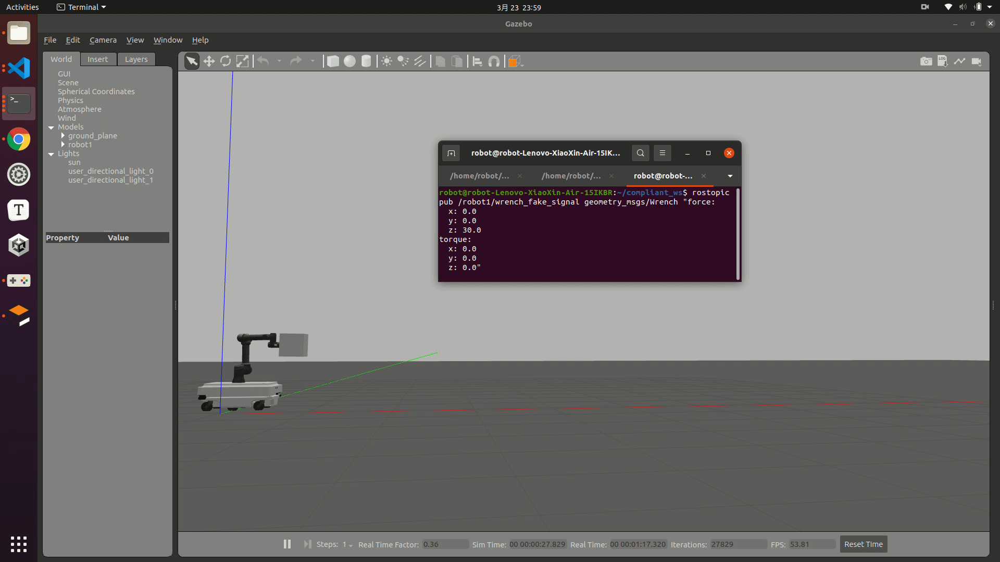

# Compliant Control and Application

  It contains the compliant control algorithms in robotic arm, and the chosen robot is **universal robot** which is popular collaborate robot in the world.

## Compile

```bash
mkdir catkin_ws/src && cd catkin_ws/src
git clone https://github.com/MingshanHe/Compliant-Control-and-Application.git
catkin build (or cd .. && catkin_make)
```

## Check

using the following command to check the self-defined controller. Like:`cartesian_velocity_controller`

```bash
rospack plugins --attrib=plugin controller_interface
```

## Run

  **Notice**: In this repository, I have used ur5e robot and its `urdf` file need to be changed in different situation, like need or not a force/torque sensor in the end effector. Please check the `urdf` file seriously and run the algorithm, Thanks.

### 1. Admittance

```bash
roslaunch ur_gazebo ur5e_bringup.launch transmission_hw_interface:=hardware_interface/PositionJointInterface specified_controller:=cartesian_velocity_controller
```

```bash
roslaunch admittance Admittance.launch
```

After the robot has moved to the desired pose, run the following commands to generate fake wrench signal

```bash
roslaunch admittance Wrench_Fake.launch
```

### 2. Impedance

```bash
roslaunch ur_gazebo ur5e_bringup.launch transmission_hw_interface:=hardware_interface/EffortJointInterface specified_controller:=joint_torque_controller
```

```
roslaunch impedance Impedance.launch
```

### 3. Application (Hybrid Admittance Control)

```bash
roslaunch mir_gazebo mir_single_test.launch tf_prefix:=robot1
```

```
roslaunch admittance HybridAdmittance.launch tf_prefix:=robot1
```

### 4. Hybrid Position Force Control

```bash
roslaunch ur_gazebo ur5e_bringup.launch transmission_hw_interface:=hardware_interface/PositionJointInterface specified_controller:=cartesian_velocity_controller environment:=polish
```

```bash
roslaunch hybrid_position_force_control hybrid_position_force_control.launch
```

  And then it needs to use the topic publish command in the terminal. It is recommended to move to the pose [-0.1, 0.3, 0.3, 0.707, -0.707, 0.0, 0.0]. 

```bash
rostopic pub /desired_carteisan_pose_cmd geometry_msgs/Pose "position: x: -0.10 y: 0.30 z: 0.30 orientation: x: 0.707 y: -0.707 z: 0.0 w: 0.0" 
```


## Performance

### 1. Admittance


### 2. Hybrid Admittance Control


### 3. Hybrid Position Force Control


